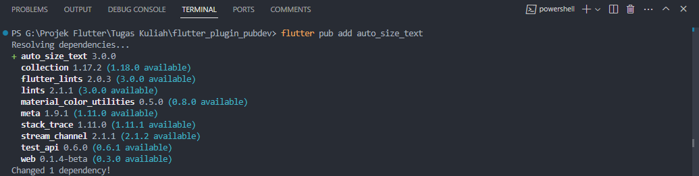
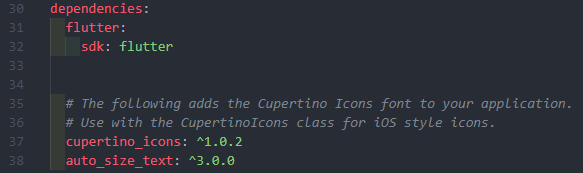
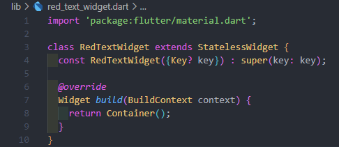
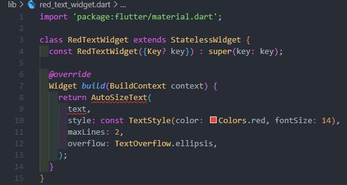
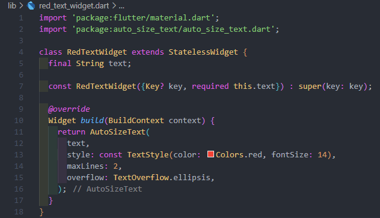
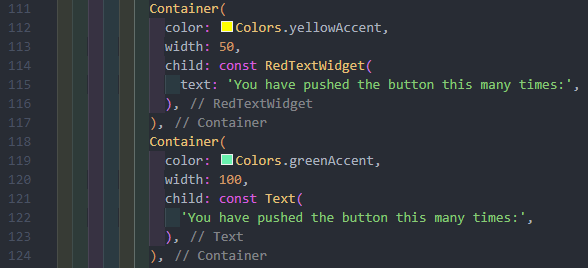
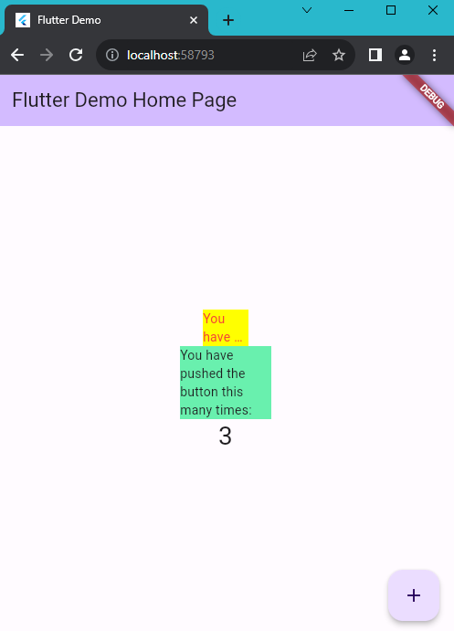

  <h3 align="center">PEMROGRAMAN MOBILE</h3>
  <h3 align="center">PRAKTIKUM MANAJEMEN PLUGIN</h3>
  

  <h3 align="center">Abiyasa Putra Prasetya</h3>
  <h3 align="center">3G - D4TI</h3>
  <h3 align="center">01</h3>
  <h3 align="center">2141720203</h3>

# Praktikum Menerapkan Plugin di Project Flutter

<h3>Langkah 1: Buat Project Baru<h3>

Buatlah sebuah project flutter baru dengan nama flutter_plugin_pubdev. Lalu jadikan repository di GitHub Anda dengan nama flutter_plugin_pubdev.

<h3>Langkah 2: Menambahkan Plugin<h3>

Tambahkan plugin auto_size_text menggunakan perintah berikut di terminal

  

Jika berhasil, maka akan tampil nama plugin beserta versinya di file pubspec.yaml pada bagian dependencies.

  

<h3>Langkah 3: Buat file red_text_widget.dart<h3>

Buat file baru bernama red_text_widget.dart di dalam folder lib lalu isi kode seperti berikut.

  

<h3>Langkah 4: Tambah Widget AutoSizeText<h3>

Masih di file red_text_widget.dart, untuk menggunakan plugin auto_size_text, ubahlah kode return Container() menjadi seperti berikut.

  

Setelah Anda menambahkan kode di atas, Anda akan mendapatkan info error. Mengapa demikian? Jelaskan dalam laporan praktikum Anda!

Jawab: Karena variabel text tidak dideklarasikan terlebih dahulu. Kita perlu menyertakan teks yang akan ditampilkan sebagai argumen dalam konstruktor RedTextWidget

<h3>Langkah 5: Buat Variabel text dan parameter di constructor<h3>

Tambahkan variabel text dan parameter di constructor seperti berikut.

  

<h3>Langkah 6: Tambahkan widget di main.dart<h3>

Buka file main.dart lalu tambahkan di dalam children: pada class _MyHomePageState

  

Run aplikasi tersebut dengan tekan F5, maka hasilnya akan seperti berikut.

  

Soal:

1. Jelaskan maksud dari langkah 2 pada praktikum tersebut!

Jawab: "flutter pub add auto_size_text" adalah perintah yang digunakan dalam Flutter untuk menambahkan sebuah paket atau library ke proyek Flutter. Dalam kasus ini, perintah ini ditujukan untuk menambahkan paket bernama "auto_size_text" ke proyek Flutter. Ini akan memungkinkan kita untuk menggunakan fitur-fitur yang ada dalam paket "auto_size_text" dalam proyek, seperti auto-sizing teks.

2. Jelaskan maksud dari langkah 5 pada praktikum tersebut!

Jawab: Kode ini menambahkan variabel text ke dalam class RedTextWidget. Variabel ini akan digunakan untuk menentukan teks yang akan ditampilkan oleh widget ini. Kemudian, dengan menambahkan parameter required this.text ke dalam constructor RedTextWidget, kita memastikan bahwa saat membuat instance dari RedTextWidget, kita harus memberikan nilai teks yang diperlukan melalui parameter ini.

3. Pada langkah 6 terdapat dua widget yang ditambahkan, jelaskan fungsi dan perbedaannya!

Jawab:

-> Kotak pertama (Container) berwarna kuning dan berisi teks yang telah disesuaikan tampilannya (dalam widget bernama RedTextWidget).

-> Kotak kedua (Container) berwarna hijau dan berisi teks biasa tanpa penyesuaian khusus (dalam widget bernama Text).

Perbedaannya terletak pada tampilan dan gaya teks yang digunakan. Kotak pertama menggunakan widget yang Anda buat sendiri untuk menampilkan teks dengan gaya tertentu, sementara kotak kedua menggunakan teks biasa tanpa gaya tambahan.

4. Jelaskan maksud dari tiap parameter yang ada di dalam plugin auto_size_text berdasarkan tautan pada dokumentasi ini !

Jawab: Parameter-parameter biasanya digunakan untuk mengkonfigurasi dan menyesuaikan perilaku widget tersebut. Ini bisa termasuk parameter untuk mengatur teks yang ditampilkan, gaya teks, jumlah maksimum baris, efek overflow, dan banyak lagi.